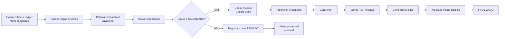

# AutoQuote — Automação Inteligente de Orçamentos com n8n

<p align="center">
  <strong>Da solicitação ao PDF final: cálculo, validação, geração de documento e armazenamento automatizados.</strong>
</p>

<p align="center">
  
  
  
  
  
</p>

<p align="center">
  
</p>

---

## Sobre o projeto

O **AutoQuote** é um fluxo de automação desenvolvido no **n8n** para transformar solicitações de orçamento registradas em uma planilha em documentos comerciais prontos para envio.

A automação consulta uma tabela de preços, valida os dados recebidos, aplica regras de negócio, calcula o valor final, separa solicitações válidas das que precisam de revisão, preenche um modelo no Google Docs, converte o documento em PDF, salva o arquivo no Google Drive e registra o link final na planilha.

O projeto foi construído como um estudo de caso prático para uma empresa de embalagens personalizadas, mas sua arquitetura pode ser adaptada para gráficas, brindes, comunicação visual, impressão 3D, serviços industriais e outros negócios que trabalham com orçamentos baseados em regras.

## Problema resolvido

Um processo manual de orçamento normalmente exige várias etapas repetitivas:

1. Ler os dados enviados pelo cliente.
2. Consultar preços e faixas de quantidade.
3. Calcular adicionais de cores, acabamento e urgência.
4. Conferir se existem informações ausentes.
5. Montar um documento comercial.
6. Gerar e salvar o PDF.
7. Registrar o resultado para acompanhamento.

Além do tempo gasto, esse processo está sujeito a erros de digitação, aplicação incorreta de preços, documentos inconsistentes e perda de rastreabilidade.

O AutoQuote centraliza todas essas etapas em um único fluxo automatizado.

## Funcionalidades

- Captura automática de novas solicitações no Google Sheets.
- Consulta centralizada à tabela de preços.
- Cálculo por tipo de embalagem, material, área e quantidade.
- Identificação automática da faixa de preço aplicável.
- Adicional por número de cores extras.
- Adicional por acabamento identificado nas observações.
- Acréscimo percentual para pedidos urgentes.
- Inclusão de custo fixo de preparação ou setup.
- Validação de campos obrigatórios.
- Validação de quantidade mínima.
- Separação entre orçamento calculado e revisão manual.
- Registro do motivo exato da revisão.
- Prevenção de registros duplicados com `Append or Update`.
- Criação automática de uma cópia do modelo comercial.
- Preenchimento dos marcadores do Google Docs.
- Conversão do documento para PDF.
- Armazenamento do PDF no Google Drive.
- Compartilhamento do arquivo em modo somente leitura.
- Atualização do link do PDF na planilha.
- Ramo opcional para alerta de revisão por e-mail.

## Visão geral do fluxo



## Arquitetura da solução

| Camada | Tecnologia | Responsabilidade |
|---|---|---|
| Entrada | Google Sheets Trigger | Detectar novas solicitações |
| Dados | Google Sheets | Armazenar solicitações, preços e resultados |
| Orquestração | n8n | Executar e conectar todas as etapas |
| Regras de negócio | JavaScript no Code Node | Validar, selecionar regras e calcular valores |
| Documento | Google Docs | Servir como modelo comercial editável |
| Arquivo final | Google Drive | Converter, armazenar e compartilhar PDFs |
| Notificação | Gmail | Alertar sobre solicitações que precisam de revisão |

## Estrutura esperada da planilha

A solução utiliza três abas principais.

### `Respostas_Formulario`

| Campo | Descrição |
|---|---|
| `id_solicitacao` | Identificador único da solicitação |
| `nome_empresa` | Nome da empresa solicitante |
| `tipo_embalagem` | Categoria do produto |
| `material` | Material escolhido |
| `dimensoes` | Largura e altura do produto |
| `quantidade` | Quantidade solicitada |
| `numero_cores` | Número de cores da personalização |
| `prazo_dias` | Prazo desejado em dias |
| `observacoes` | Acabamentos e informações adicionais |

### `Tabela_Precos`

| Campo | Descrição |
|---|---|
| `codigo_regra` | Identificador da regra |
| `categoria` | `PRECO_BASE`, `ACABAMENTO`, `URGENCIA` ou `PARAMETRO` |
| `tipo_embalagem` | Tipo de embalagem atendido |
| `material` | Material da regra |
| `area_min_cm2` | Área mínima da faixa |
| `area_max_cm2` | Área máxima da faixa |
| `quantidade_min` | Quantidade mínima da faixa |
| `quantidade_max` | Quantidade máxima da faixa |
| `preco_base_unitario` | Preço unitário base |
| `setup_pedido` | Custo fixo de preparação |
| `adicional_cor_extra_unitario` | Valor por cor adicional |
| `termo_observacao` | Palavra usada para identificar acabamentos |
| `adicional_acabamento_unitario` | Valor adicional por acabamento |
| `prazo_max_dias` | Limite da regra de urgência |
| `percentual_urgencia` | Percentual adicional de urgência |
| `parametro` | Nome de um parâmetro global |
| `valor_parametro` | Valor do parâmetro global |
| `ativo` | Indica se a regra está disponível |

### `Orcamentos`

| Campo | Descrição |
|---|---|
| `id_orcamento` | Identificador do orçamento |
| `id_solicitacao` | Referência à solicitação original |
| `data_processamento` | Data e hora do processamento |
| `codigo_regra_preco` | Regra utilizada no cálculo |
| `preco_base_unitario` | Preço base encontrado |
| `adicional_cores_unitario` | Adicional por cores |
| `adicional_acabamento_unitario` | Adicional por acabamento |
| `setup` | Custo fixo de preparação |
| `percentual_urgencia` | Percentual de urgência aplicado |
| `subtotal` | Valor antes da urgência |
| `valor_total` | Valor final do orçamento |
| `status` | `CALCULADO`, `REVISAO` ou `FINALIZADO` |
| `motivo_revisao` | Motivo que impediu o cálculo automático |
| `validade_ate` | Data de validade do orçamento |
| `link_pdf` | Link do PDF armazenado no Drive |

## Como o cálculo funciona

A automação segue esta sequência:

1. Normaliza textos para evitar problemas com letras maiúsculas, espaços e acentos.
2. Converte valores monetários brasileiros, como `R$ 1,90`, para números utilizáveis no JavaScript.
3. Calcula a área a partir das dimensões informadas.
4. Localiza uma regra que combine tipo de embalagem, material, faixa de área e faixa de quantidade.
5. Calcula as cores extras a partir da primeira cor incluída.
6. Procura termos de acabamento nas observações.
7. Identifica se o prazo exige adicional de urgência.
8. Adiciona o custo de setup.
9. Calcula o subtotal e o valor total.
10. Define a validade do orçamento.

```text
valor_unitario = preço_base
               + adicional_de_cores
               + adicional_de_acabamento

subtotal = valor_unitario × quantidade + setup

valor_total = subtotal × (1 + percentual_de_urgência)
```

## Tratamento de revisão

Uma solicitação não gera PDF automaticamente quando apresenta algum problema, como:

- material não informado;
- dimensões ausentes ou inválidas;
- quantidade abaixo do mínimo;
- número de cores inválido;
- prazo inválido;
- ausência de uma regra de preço compatível.

Nesses casos, o fluxo retorna:

```text
status: REVISAO
motivo_revisao: descrição detalhada do problema
```

Isso evita que um orçamento incompleto ou incorreto seja enviado ao cliente.

## Modelo do Google Docs

O documento-modelo utiliza marcadores como:

```text
{{ID_ORCAMENTO}}
{{NOME_EMPRESA}}
{{TIPO_EMBALAGEM}}
{{MATERIAL}}
{{DIMENSOES}}
{{QUANTIDADE}}
{{NUMERO_CORES}}
{{PRAZO_DIAS}}
{{PRECO_BASE_UNITARIO}}
{{ADICIONAL_CORES}}
{{ADICIONAL_ACABAMENTO}}
{{SETUP}}
{{SUBTOTAL}}
{{PERCENTUAL_URGENCIA}}
{{VALOR_TOTAL}}
{{VALIDADE_ATE}}
{{CODIGO_REGRA}}
```

O n8n cria uma cópia do documento para cada orçamento e executa ações de busca e substituição antes da geração do PDF.

## Como importar e configurar

O workflow público e sanitizado está disponível em:

```text
AutoQuote - Gerar orçamento.json
```

### Pré-requisitos

- Instância do n8n local ou hospedada.
- Conta Google com acesso ao Sheets, Docs, Drive e opcionalmente Gmail.
- APIs correspondentes habilitadas no Google Cloud.
- Credenciais OAuth2 configuradas no n8n.
- Planilha com as abas e colunas descritas neste README.
- Documento-modelo no Google Docs.
- Pasta de destino no Google Drive.

### Configuração

1. Importe o arquivo JSON no n8n.
2. Selecione ou crie as credenciais de cada node Google.
3. Substitua `SUBSTITUA_PELO_ID_DA_PLANILHA` pelo ID da sua planilha.
4. Confira as abas `Respostas_Formulario`, `Tabela_Precos` e `Orcamentos`.
5. Substitua `SUBSTITUA_PELO_ID_DO_MODELO_GOOGLE_DOCS` pelo ID do modelo.
6. Substitua `SUBSTITUA_PELO_ID_DA_PASTA_NO_DRIVE` pelo ID da pasta dos PDFs.
7. Configure o e-mail do alerta de revisão, caso utilize esse ramo.
8. Execute o fluxo em modo de teste.
9. Envie uma nova solicitação para validar o processamento completo.
10. Publique ou ative o workflow.

## Principais desafios encontrados

### Valores monetários virando zero

Os preços do Google Sheets chegavam como texto, por exemplo:

```text
R$ 1,90
```

Uma conversão direta com `Number()` gera `NaN`. Foi necessário limpar símbolos, espaços e separadores, além de tratar formatos brasileiros e internacionais.

### Todas as solicitações indo para revisão

O filtro de regras considerava somente alguns valores específicos na coluna `ativo`. Como células vazias também deveriam representar regras utilizáveis, o filtro foi alterado para desativar apenas valores explicitamente negativos.

### Google Docs aceitando apenas texto

Campos como quantidade, número de cores e prazo eram enviados como números. A API do Google Docs exige texto para a operação de substituição, então esses valores precisaram ser convertidos com `String()`.

### Referências quebradas após renomear nodes

Expressões como:

```javascript
$('Verificar status').item.json.valor_total
```

dependem do nome exato do node. Alterar o nome do node sem atualizar as expressões gera erro de referência.

### Atualização do link usando o item errado

Após o compartilhamento do arquivo, o item atual contém dados da permissão do Drive, não os dados do orçamento. Foi necessário consultar explicitamente os nodes anteriores para recuperar o `id_solicitacao` e o ID correto do PDF.

### Execuções repetidas criando arquivos duplicados

Durante os testes, várias cópias do mesmo documento foram geradas. Isso mostrou a importância de usar identificadores únicos, conferir o ID exato do arquivo e separar testes manuais de execuções definitivas.

## O que aprendi com o projeto

- Modelar um processo de negócio antes de automatizá-lo.
- Transformar uma tabela de preços em regras consultáveis.
- Trabalhar com múltiplos itens em um Code Node do n8n.
- Preservar o vínculo entre itens ao longo de vários nodes.
- Usar `Append or Update` para evitar duplicidade de registros.
- Criar caminhos condicionais com o node IF.
- Integrar Google Sheets, Docs, Drive e Gmail.
- Manipular dados em JavaScript dentro do n8n.
- Normalizar textos, moedas, percentuais e datas.
- Diagnosticar erros de tipo retornados por APIs.
- Criar documentos a partir de templates.
- Converter arquivos do Google Workspace em PDF.
- Controlar permissões de compartilhamento no Google Drive.
- Separar fluxos automáticos de casos que exigem decisão humana.
- Sanitizar um workflow antes de publicá-lo no GitHub.
- Documentar uma automação para que outra pessoa consiga reproduzi-la.

## Decisões de projeto

- **Google Sheets como base inicial:** reduz o custo e facilita a manutenção das regras por usuários não técnicos.
- **Code Node para regras de negócio:** oferece mais controle do que encadear dezenas de nodes pequenos.
- **Revisão manual como caminho válido:** nem toda exceção deve ser forçada para dentro da automação.
- **Modelo no Google Docs:** permite que o layout comercial seja alterado sem modificar o workflow.
- **PDF no Google Drive:** centraliza os arquivos e facilita o compartilhamento.
- **Workflow sanitizado:** demonstra a solução sem expor IDs, contas ou dados reais.

## Segurança

Este repositório não deve conter:

- tokens OAuth;
- Client ID e Client Secret;
- arquivos de credenciais;
- e-mails pessoais;
- IDs reais de planilhas, documentos e pastas;
- dados de clientes;
- histórico de execuções;
- conteúdo real de orçamentos.

O workflow publicado foi sanitizado e utiliza placeholders para os recursos externos.

> Mesmo quando o n8n não exporta os tokens diretamente, nomes e IDs de credenciais, URLs de documentos e metadados da instância devem ser removidos antes da publicação.

## Limitações atuais

- A tabela de preços precisa conter todas as combinações válidas.
- As dimensões são interpretadas a partir dos dois primeiros números encontrados.
- O fluxo ainda não possui interface própria para administração.
- A planilha funciona bem para um MVP, mas pode não ser suficiente para alto volume.
- O alerta de revisão está preparado, porém pode permanecer desativado até a configuração do Gmail.
- Não existe autenticação ou portal do cliente.
- O workflow local depende da máquina estar ligada; para operação contínua, o n8n precisa ser hospedado.

## Status

**MVP funcional.**

O fluxo já é capaz de receber solicitações, calcular orçamentos, identificar revisões, gerar documentos, converter PDFs, armazenar os arquivos e registrar os links finais.

## Autor

Desenvolvido por **Yruam Käffer** como projeto prático de automação, integração de serviços e aplicação de regras de negócio com n8n.

---

<p align="center">
  Feito com curiosidade, persistência, alguns erros 400 e muitos nodes verdes. 🚀
</p>
